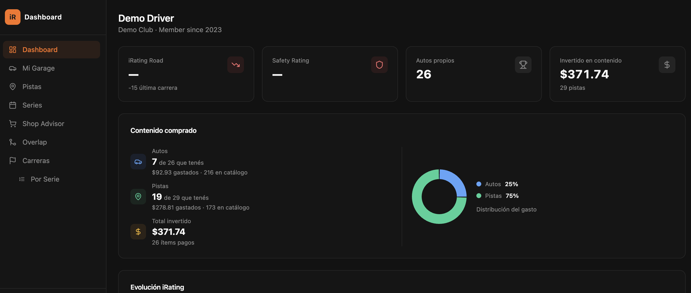
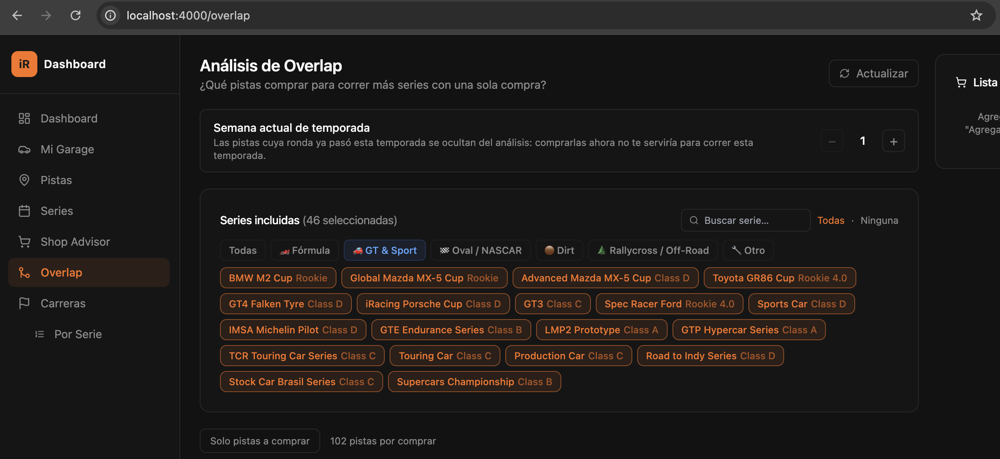

# iRacing Dashboard

Dashboard personal para gestionar tu temporada en iRacing: garage, pistas, análisis de overlap, recomendaciones de compra e historial de carreras. Funciona en modo offline con datos mock o conectado a la API oficial de iRacing.

---

## Demo

| Dashboard | Análisis de Overlap |
|---|---|
|  |  |

> Capturas con datos de demostración (`USE_MOCK=true`) — no requieren cuenta de iRacing para probarlo.

---

## ☕ Apoyá el proyecto

Si te resultó útil y querés invitarme un café:

**[cafecito.app/mati9099](https://cafecito.app/mati9099)**

---

## Stack

| Capa | Tecnología |
|------|-----------|
| Backend | Python 3.11 · FastAPI · Uvicorn · SQLite |
| Frontend | React 18 · TypeScript · Vite · Tailwind CSS · shadcn/ui |
| Datos mock | Datos reales 2026 S2 incluidos (no requiere API) |

---

## Requisitos previos

- **Python 3.11** — `brew install python@3.11` en macOS
- **Node.js 18+** — para el frontend
- **poppler** — para importar PDFs del calendario: `brew install poppler`
- (Opcional) Credenciales de la [API de iRacing](https://members-ng.iracing.com/data/doc) para datos en tiempo real

---

## Levantar el proyecto

```bash
# Opción rápida — levanta backend + frontend con un solo comando
./restart.sh
```

Luego abrir: **http://localhost:4000**

### Manual (si preferís control individual)

```bash
# Backend (puerto 4001)
cd backend
python3.11 -m venv venv
source venv/bin/activate
pip install -r requirements.txt
python main.py

# Frontend (puerto 4000) — en otra terminal
cd frontend
npm install
npm run dev
```

### Variables de entorno (backend)

El archivo `.env` se crea automáticamente desde `.env.example`. Las principales:

```bash
USE_MOCK=true        # true = datos locales; false = API real de iRacing
BACKEND_PORT=4001
```

---

## Funcionalidades

### Dashboard
Resumen general: iRating actual, Safety Rating, carreras recientes y estado del garage.

### Mi Garage (`/garage`)
Listado de autos propios filtrado por categoría. Muestra precio, categoría y disponibilidad en series activas.

### Pistas (`/tracks`)
Todas las pistas disponibles con sus configuraciones. Indica cuáles ya tenés y cuáles requieren compra.

### Series (`/calendar`)
Calendario de la temporada activa: qué series podés correr con tu garage actual, qué pistas y autos te faltan, y el costo estimado para completar cada serie.

### Overlap (`/overlap`)
Análisis de superposición de pistas: dado un conjunto de series, qué pistas aparecen en más de una. Ayuda a priorizar compras de pistas con máximo impacto. Soporta filtro de vista **Todo / Fórmula / Sport Car**.

Lista de deseos integrada: marcá las pistas que querés comprar y el panel lateral muestra el costo total estimado.

### Shop Advisor (`/shop`)
Recomendaciones de compra en bundles de 3 ítems. Calcula el ahorro con los descuentos de iRacing:

| Cantidad | Descuento |
|----------|-----------|
| 3–5 ítems | 10% |
| 6+ ítems | 15% |

### Carreras (`/races`)
Historial de carreras recientes con posición, incidentes, laptimes y evolución de iRating.

### Por Serie (`/races/by-series`)
Mismo historial agrupado por serie: cantidad de carreras, mejor posición e incidentes totales.

### Configuración (`/settings`)

**Autos en mi Garage** — marcá manualmente qué autos tenés (útil cuando la API está caída). Buscador integrado.

**Pistas que tengo** — marcá manualmente qué pistas compraste. Buscador integrado.

**Importar Calendario (PDF)** — subí el PDF oficial de iRacing con el calendario de la temporada. El sistema:
1. Extrae el texto con `pdftotext` (poppler)
2. Parsea series, pistas y clases de licencia
3. Muestra una vista previa con el porcentaje de pistas reconocidas
4. Importa solo las series que seleccionés

**Reiniciar calendario** — vuelve a los datos 2026 S2 incluidos en la app.

---

## Modos de vista

En el panel lateral hay un selector **Todo / Fórmula / Sport Car** que filtra las vistas de Series, Overlap y Carreras para mostrar solo las series relevantes a tu categoría.

---

## Modo offline (mock)

Con `USE_MOCK=true` la app usa datos locales que incluyen:
- 21 autos (14 Sport Cars propios + 3 Fórmula + 4 extras)
- 65 pistas (24 propias + 41 disponibles para comprar)
- 13 series reales de la temporada 2026 S2 (10 Sport Car + 3 Fórmula)

Podés editar `backend/infrastructure/iracing/mock/mock_data.py` para ajustar qué autos y pistas marcás como propios.

---

## Seguridad

Este proyecto está diseñado para uso personal en `localhost`. Consideraciones para quien lo clona:

- **Credenciales iRacing**: se almacenan cifradas con Fernet (AES-128) en un SQLite local. La clave se genera automáticamente en `.secret_key` (permisos `600`, excluido de git).
- **Archivos sensibles**: `.env`, `.secret_key` y `credentials.db` están en `.gitignore` — **nunca los commiteés**.
- **CORS**: la API solo acepta peticiones desde `http://localhost:4000`. No expongas el backend a una red pública.
- **Sin auth en la API**: los endpoints no requieren token. Si corrés esto en un servidor compartido, agregá autenticación adicional.
- **PDF upload**: el parser usa `pdftotext` sobre un archivo temporal generado por Python, sin exponer la ruta del usuario al sistema.
- **SQL injection**: todas las queries usan parámetros `?`, sin interpolación de strings.

---

## Estructura del proyecto

```
iracing/
├── backend/
│   ├── domain/           # Entidades y contratos de repositorios
│   ├── application/      # Casos de uso (recomendaciones)
│   ├── infrastructure/
│   │   ├── auth/         # Almacenamiento cifrado de credenciales
│   │   ├── iracing/      # Repositorios: API real + mock
│   │   └── storage/      # SQLite: series, wishlist, overrides de ownership
│   └── presentation/     # FastAPI: todos los endpoints HTTP
├── frontend/
│   ├── src/
│   │   ├── api/          # Cliente HTTP tipado
│   │   ├── components/   # Sidebar, cards, UI base (shadcn)
│   │   ├── context/      # RacingModeContext (filtro Todo/Fórmula/Sport)
│   │   └── pages/        # Dashboard, Garage, Tracks, Calendar, Overlap, Settings…
│   └── vite.config.ts
├── restart.sh            # Script para levantar todo de una vez
└── README.md
```

---

## Logs

```bash
tail -f logs/backend.log
tail -f logs/frontend.log
```
